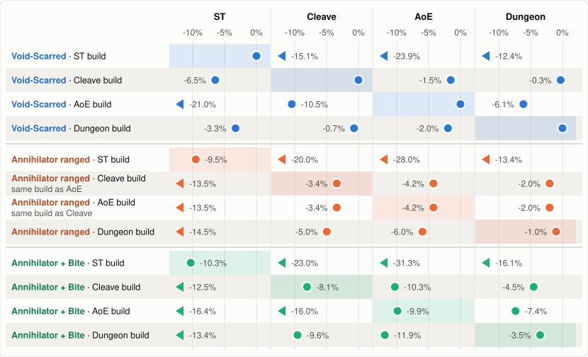

SimC profile for Devourer Demon Hunter, Midnight 12.1.5 PTR.

`devourer.simc` carries two gear sets. Void-Scarred is the active one and Annihilator sits commented
out below it. Each hero tree wears its own set. Everything here is simmed at target_error 0.05, and
every group report sims every build, so each build is measured on every scenario.

Each row is a build and each column a scenario. The number beside a dot is how far that build is
behind the best build there, and the shaded cell is the scenario the build was made for.

## ST: 1 target, 300s, lust ([report](https://mimiron.raidbots.com/simbot/report/2mziYa2g6u4We2RWHuqdB7))

| Build | DPS | Build report |
|---|---|---|
| Void-Scarred, ST build | 280,443 | [report](https://mimiron.raidbots.com/simbot/report/ijbdZ2z7uFdAggzHJCsMqW) |
| Void-Scarred, Dungeon build | 271,248 | [report](https://mimiron.raidbots.com/simbot/report/17vRCevnnmmt1h4obWmjru) |
| Void-Scarred, Cleave build | 262,311 | [report](https://mimiron.raidbots.com/simbot/report/1vsZmhghV6fYTgAfDxf6hE) |
| Annihilator ranged, ST build | 253,726 | [report](https://mimiron.raidbots.com/simbot/report/5NeGJ5S5hhHNTfwCq5Gapu) |
| Annihilator + Bite, ST build | 251,512 | [report](https://mimiron.raidbots.com/simbot/report/qvv3zYensXBYZsVMinUNyc) |
| Annihilator + Bite, Cleave build | 245,381 | [report](https://mimiron.raidbots.com/simbot/report/peExcL3ZB4wvTEMWucgmCs) |
| Annihilator + Bite, Dungeon build | 242,848 | [report](https://mimiron.raidbots.com/simbot/report/6bhDcNaUycy1Ppy5ppx46C) |
| Annihilator ranged, Cleave build (same build as AoE) | 242,597 | [report](https://mimiron.raidbots.com/simbot/report/vHPLRETJv9LPSpxqNuU8rE) |
| Annihilator ranged, AoE build (same build as Cleave) | 242,597 | [report](https://mimiron.raidbots.com/simbot/report/vHPLRETJv9LPSpxqNuU8rE) |
| Annihilator ranged, Dungeon build | 239,877 | [report](https://mimiron.raidbots.com/simbot/report/iAyF9QFMm6Hz9xh8YbdqN8) |
| Annihilator + Bite, AoE build | 234,351 | [report](https://mimiron.raidbots.com/simbot/report/g3yaB9P85ZJVzBr2VZAQ8T) |
| Void-Scarred, AoE build | 221,426 | [report](https://mimiron.raidbots.com/simbot/report/n4R93WfWmbguFfuLGihrz5) |

## Cleave: 3 targets, 300s, lust ([report](https://mimiron.raidbots.com/simbot/report/tt3VBtjhPJRMAj4ZgBbnD1))

| Build | DPS | Build report |
|---|---|---|
| Void-Scarred, Cleave build | 541,718 | [report](https://mimiron.raidbots.com/simbot/report/1vsZmhghV6fYTgAfDxf6hE) |
| Void-Scarred, Dungeon build | 537,976 | [report](https://mimiron.raidbots.com/simbot/report/17vRCevnnmmt1h4obWmjru) |
| Annihilator ranged, Cleave build (same build as AoE) | 523,312 | [report](https://mimiron.raidbots.com/simbot/report/vHPLRETJv9LPSpxqNuU8rE) |
| Annihilator ranged, AoE build (same build as Cleave) | 523,312 | [report](https://mimiron.raidbots.com/simbot/report/vHPLRETJv9LPSpxqNuU8rE) |
| Annihilator ranged, Dungeon build | 514,889 | [report](https://mimiron.raidbots.com/simbot/report/iAyF9QFMm6Hz9xh8YbdqN8) |
| Annihilator + Bite, Cleave build | 498,023 | [report](https://mimiron.raidbots.com/simbot/report/peExcL3ZB4wvTEMWucgmCs) |
| Annihilator + Bite, Dungeon build | 489,945 | [report](https://mimiron.raidbots.com/simbot/report/6bhDcNaUycy1Ppy5ppx46C) |
| Void-Scarred, AoE build | 485,090 | [report](https://mimiron.raidbots.com/simbot/report/n4R93WfWmbguFfuLGihrz5) |
| Void-Scarred, ST build | 460,095 | [report](https://mimiron.raidbots.com/simbot/report/ijbdZ2z7uFdAggzHJCsMqW) |
| Annihilator + Bite, AoE build | 455,000 | [report](https://mimiron.raidbots.com/simbot/report/g3yaB9P85ZJVzBr2VZAQ8T) |
| Annihilator ranged, ST build | 433,536 | [report](https://mimiron.raidbots.com/simbot/report/5NeGJ5S5hhHNTfwCq5Gapu) |
| Annihilator + Bite, ST build | 417,240 | [report](https://mimiron.raidbots.com/simbot/report/qvv3zYensXBYZsVMinUNyc) |

## AoE: 5 targets, 300s, lust ([report](https://mimiron.raidbots.com/simbot/report/hySrbzmcymZs2oBYF9n2Wn))

| Build | DPS | Build report |
|---|---|---|
| Void-Scarred, AoE build | 753,359 | [report](https://mimiron.raidbots.com/simbot/report/n4R93WfWmbguFfuLGihrz5) |
| Void-Scarred, Cleave build | 741,857 | [report](https://mimiron.raidbots.com/simbot/report/1vsZmhghV6fYTgAfDxf6hE) |
| Void-Scarred, Dungeon build | 738,552 | [report](https://mimiron.raidbots.com/simbot/report/17vRCevnnmmt1h4obWmjru) |
| Annihilator ranged, Cleave build (same build as AoE) | 721,383 | [report](https://mimiron.raidbots.com/simbot/report/vHPLRETJv9LPSpxqNuU8rE) |
| Annihilator ranged, AoE build (same build as Cleave) | 721,383 | [report](https://mimiron.raidbots.com/simbot/report/vHPLRETJv9LPSpxqNuU8rE) |
| Annihilator ranged, Dungeon build | 708,429 | [report](https://mimiron.raidbots.com/simbot/report/iAyF9QFMm6Hz9xh8YbdqN8) |
| Annihilator + Bite, AoE build | 678,937 | [report](https://mimiron.raidbots.com/simbot/report/g3yaB9P85ZJVzBr2VZAQ8T) |
| Annihilator + Bite, Cleave build | 675,847 | [report](https://mimiron.raidbots.com/simbot/report/peExcL3ZB4wvTEMWucgmCs) |
| Annihilator + Bite, Dungeon build | 663,969 | [report](https://mimiron.raidbots.com/simbot/report/6bhDcNaUycy1Ppy5ppx46C) |
| Void-Scarred, ST build | 573,124 | [report](https://mimiron.raidbots.com/simbot/report/ijbdZ2z7uFdAggzHJCsMqW) |
| Annihilator ranged, ST build | 542,310 | [report](https://mimiron.raidbots.com/simbot/report/5NeGJ5S5hhHNTfwCq5Gapu) |
| Annihilator + Bite, ST build | 517,478 | [report](https://mimiron.raidbots.com/simbot/report/qvv3zYensXBYZsVMinUNyc) |

## Dungeon: Temple of Sethraliss route, +20 keystone ([report](https://mimiron.raidbots.com/simbot/report/1uhNYhw66uDDimgq2z3XeA))

`temple-of-sethraliss-route.simc` walks a Temple of Sethraliss M+ route end to end. The pulls,
the chaining and the mob health all come off 12.1 PTR logs, scaled down to one actor, with health
at a +20 keystone. Run it with:

    simc devourer.simc temple-of-sethraliss-route.simc

| Build | DPS | Build report |
|---|---|---|
| Void-Scarred, Dungeon build | 612,164 | [report](https://mimiron.raidbots.com/simbot/report/17vRCevnnmmt1h4obWmjru) |
| Void-Scarred, Cleave build | 610,402 | [report](https://mimiron.raidbots.com/simbot/report/1vsZmhghV6fYTgAfDxf6hE) |
| Annihilator ranged, Dungeon build | 606,047 | [report](https://mimiron.raidbots.com/simbot/report/iAyF9QFMm6Hz9xh8YbdqN8) |
| Annihilator ranged, Cleave build (same build as AoE) | 599,759 | [report](https://mimiron.raidbots.com/simbot/report/vHPLRETJv9LPSpxqNuU8rE) |
| Annihilator ranged, AoE build (same build as Cleave) | 599,759 | [report](https://mimiron.raidbots.com/simbot/report/vHPLRETJv9LPSpxqNuU8rE) |
| Annihilator + Bite, Dungeon build | 590,725 | [report](https://mimiron.raidbots.com/simbot/report/6bhDcNaUycy1Ppy5ppx46C) |
| Annihilator + Bite, Cleave build | 584,465 | [report](https://mimiron.raidbots.com/simbot/report/peExcL3ZB4wvTEMWucgmCs) |
| Void-Scarred, AoE build | 574,618 | [report](https://mimiron.raidbots.com/simbot/report/n4R93WfWmbguFfuLGihrz5) |
| Annihilator + Bite, AoE build | 567,106 | [report](https://mimiron.raidbots.com/simbot/report/g3yaB9P85ZJVzBr2VZAQ8T) |
| Void-Scarred, ST build | 536,004 | [report](https://mimiron.raidbots.com/simbot/report/ijbdZ2z7uFdAggzHJCsMqW) |
| Annihilator ranged, ST build | 530,151 | [report](https://mimiron.raidbots.com/simbot/report/5NeGJ5S5hhHNTfwCq5Gapu) |
| Annihilator + Bite, ST build | 513,428 | [report](https://mimiron.raidbots.com/simbot/report/qvv3zYensXBYZsVMinUNyc) |

## Hashes

Each row links a report for that build on its own, so you can check its gear and talents.

| Build | Hash | Report |
|---|---|---|
| Void-Scarred, ST build | `CgcBAAAAAAAAAAAAAAAAAAAAAAAWMzMzMzMzMwMAAAAAAALzYMYGAAAAAAAAmxMMmZmZYmZYmlZGjNttAgAGAjZmZbmZa2mZbmhxMGA` | [report](https://mimiron.raidbots.com/simbot/report/ijbdZ2z7uFdAggzHJCsMqW) |
| Void-Scarred, Cleave build | `CgcBAAAAAAAAAAAAAAAAAAAAAAAWMzMzMzMzMwMAAAAAAALzYMYGAAAAAAAAmxMMmZmZGzMDzsMDjNtsAgAGAjZmZZmZa2mZbmZwMGA` | [report](https://mimiron.raidbots.com/simbot/report/1vsZmhghV6fYTgAfDxf6hE) |
| Void-Scarred, AoE build | `CgcBAAAAAAAAAAAAAAAAAAAAAAAWMzMzMzMzMwMAAAAAAALzYMYGAAAAAAAAmxMMzMzMzYmBzsMzYsplFAEwAMMzMLzMTz2MbGGGzA` | [report](https://mimiron.raidbots.com/simbot/report/n4R93WfWmbguFfuLGihrz5) |
| Void-Scarred, Dungeon build | `CgcBAAAAAAAAAAAAAAAAAAAAAAAWMzMzMzMzMwMAAAAAAALzYMYGAAAAAAAAmxMMmZmZGzMDzsMzYsplFAEwAYMzMLzMTz2MbmZMmxA` | [report](https://mimiron.raidbots.com/simbot/report/17vRCevnnmmt1h4obWmjru) |
| Annihilator ranged, ST build | `CgcBAAAAAAAAAAAAAAAAAAAAAAA2MmZmZmZmBzMAAAAAAALzYAzAAAAAAAAwMGMzMzMjZmZGzsYGjFtswMzMzWbzMzAYmZAIwDMGMMA` | [report](https://mimiron.raidbots.com/simbot/report/5NeGJ5S5hhHNTfwCq5Gapu) |
| Annihilator ranged, Cleave = AoE build | `CgcBAAAAAAAAAAAAAAAAAAAAAAA2MmZmZmZmBzMAAAAAAALzYAzAAAAAAAAwMGMzMzMzMzMDzsYGjFZhZmZmt2mZmBwYGAC8AjZYMD` | [report](https://mimiron.raidbots.com/simbot/report/vHPLRETJv9LPSpxqNuU8rE) |
| Annihilator ranged, Dungeon build | `CgcBAAAAAAAAAAAAAAAAAAAAAAA2MmZmZmZmBzMAAAAAAALzYAzAAAAAAAAwMGMzMzMzMzMDzsYGjFZhZmZmtWmZmBwYGAC8AjZYMD` | [report](https://mimiron.raidbots.com/simbot/report/iAyF9QFMm6Hz9xh8YbdqN8) |
| Annihilator + Bite, ST build | `CgcBAAAAAAAAAAAAAAAAAAAAAAA2MmZmZmZmBzMAAAAAAALzYAzAAAAAAAAwMGMmZmZMzMzYmFzYsolFmZmZ2abmZGAzMDABmZgZMA` | [report](https://mimiron.raidbots.com/simbot/report/qvv3zYensXBYZsVMinUNyc) |
| Annihilator + Bite, Cleave build | `CgcBAAAAAAAAAAAAAAAAAAAAAAA2MmZmZmZmBzMAAAAAAALzYAzAAAAAAAAwMGMPwMzMzMzMDzsYGjFZhZmZmt2mZmBwYGACMzMYGD` | [report](https://mimiron.raidbots.com/simbot/report/peExcL3ZB4wvTEMWucgmCs) |
| Annihilator + Bite, AoE build | `CgcBAAAAAAAAAAAAAAAAAAAAAAA2MmZmZmZmBzMAAAAAAALzYAzAAAAAAAAwMGMzMzMzMzMYmFzYsolFmZmZ2abmZGAjZAIwMDMjB` | [report](https://mimiron.raidbots.com/simbot/report/g3yaB9P85ZJVzBr2VZAQ8T) |
| Annihilator + Bite, Dungeon build | `CgcBAAAAAAAAAAAAAAAAAAAAAAA2MmZmZmZmBzMAAAAAAALzYAzAAAAAAAAwMGMPwMzMzMzMDzsYGjFZhZmZmtWmZmBwYGACMzMYGD` | [report](https://mimiron.raidbots.com/simbot/report/6bhDcNaUycy1Ppy5ppx46C) |

## Contributing

PRs welcome! If you beat one of these numbers include the profile changes and a Raidbots report at target_error 0.05.
