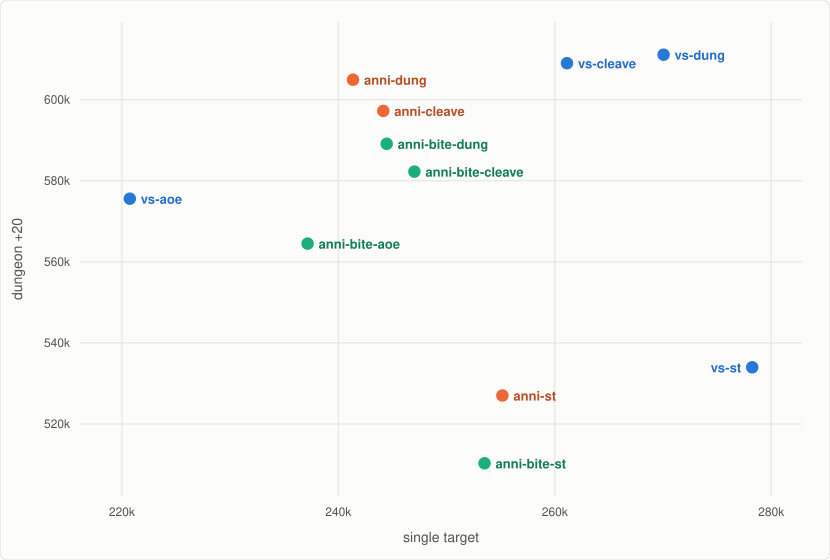

SimC profile for Devourer Demon Hunter, Midnight 12.1.5 PTR.

`devourer.simc` carries two gear sets. Void-Scarred is the active one and Annihilator sits commented
out below it. Each hero tree wears its own set. Everything here is simmed at target_error 0.05, and
every group report sims every build, so each build is measured on every scenario.

Each dot is a build, named for the fight it was made for. Further right is more single-target
damage, higher is more damage in the +20 dungeon. The tables below have every build on every fight.

## ST: 1 target, 300s, lust ([report](https://mimiron.raidbots.com/simbot/report/3BsuyHyagC9GNyUzd4ADPr))

| Build | DPS | Build report |
|---|---|---|
| vs-st | 278,258 | [report](https://mimiron.raidbots.com/simbot/report/p255SqYk5THaPWGqj9gZLf) |
| vs-dung | 270,063 | [report](https://mimiron.raidbots.com/simbot/report/qKjQLLQCpcmiZ7EiNGvQeV) |
| vs-cleave | 261,158 | [report](https://mimiron.raidbots.com/simbot/report/xs1pNaEVyRqaR8UMQYjHXW) |
| anni-st | 255,650 | [report](https://mimiron.raidbots.com/simbot/report/v74m8s9r3wbx3cBTuRs2FB) |
| anni-bite-st | 253,949 | [report](https://mimiron.raidbots.com/simbot/report/tSKFjsoxjWm4xDLtKLy3HD) |
| anni-bite-cleave | 247,000 | [report](https://mimiron.raidbots.com/simbot/report/hLDwBXjqJso6XpuAj96mFQ) |
| anni-bite-dung | 244,360 | [report](https://mimiron.raidbots.com/simbot/report/sSqNRwkatXzdhfgoepkcGW) |
| anni-cleave | 244,124 | [report](https://mimiron.raidbots.com/simbot/report/be2fcscPxuGXoLBei2Psq1) |
| anni-dung | 241,425 | [report](https://mimiron.raidbots.com/simbot/report/8BZfE3GTkrdR6AANY1A5U6) |
| anni-bite-aoe | 237,123 | [report](https://mimiron.raidbots.com/simbot/report/whZV4MjAs9d5PNUQQAhAeD) |
| vs-aoe | 220,676 | [report](https://mimiron.raidbots.com/simbot/report/8k9Xe22fPurFsKZszVFqfN) |

## Cleave: 3 targets, 300s, lust ([report](https://mimiron.raidbots.com/simbot/report/ezArJTnRGzQYXzPp2bfwR1))

| Build | DPS | Build report |
|---|---|---|
| vs-cleave | 540,308 | [report](https://mimiron.raidbots.com/simbot/report/xs1pNaEVyRqaR8UMQYjHXW) |
| vs-dung | 536,678 | [report](https://mimiron.raidbots.com/simbot/report/qKjQLLQCpcmiZ7EiNGvQeV) |
| anni-cleave | 524,263 | [report](https://mimiron.raidbots.com/simbot/report/be2fcscPxuGXoLBei2Psq1) |
| anni-dung | 516,213 | [report](https://mimiron.raidbots.com/simbot/report/8BZfE3GTkrdR6AANY1A5U6) |
| anni-bite-cleave | 497,075 | [report](https://mimiron.raidbots.com/simbot/report/hLDwBXjqJso6XpuAj96mFQ) |
| anni-bite-dung | 489,171 | [report](https://mimiron.raidbots.com/simbot/report/sSqNRwkatXzdhfgoepkcGW) |
| vs-aoe | 483,765 | [report](https://mimiron.raidbots.com/simbot/report/8k9Xe22fPurFsKZszVFqfN) |
| vs-st | 457,854 | [report](https://mimiron.raidbots.com/simbot/report/p255SqYk5THaPWGqj9gZLf) |
| anni-bite-aoe | 454,296 | [report](https://mimiron.raidbots.com/simbot/report/whZV4MjAs9d5PNUQQAhAeD) |
| anni-st | 433,374 | [report](https://mimiron.raidbots.com/simbot/report/v74m8s9r3wbx3cBTuRs2FB) |
| anni-bite-st | 417,843 | [report](https://mimiron.raidbots.com/simbot/report/tSKFjsoxjWm4xDLtKLy3HD) |

## AoE: 5 targets, 300s, lust ([report](https://mimiron.raidbots.com/simbot/report/hG68CCAz15EHckxpdYwQAH))

| Build | DPS | Build report |
|---|---|---|
| vs-aoe | 756,639 | [report](https://mimiron.raidbots.com/simbot/report/8k9Xe22fPurFsKZszVFqfN) |
| vs-cleave | 737,599 | [report](https://mimiron.raidbots.com/simbot/report/xs1pNaEVyRqaR8UMQYjHXW) |
| vs-dung | 736,188 | [report](https://mimiron.raidbots.com/simbot/report/qKjQLLQCpcmiZ7EiNGvQeV) |
| anni-cleave | 722,149 | [report](https://mimiron.raidbots.com/simbot/report/be2fcscPxuGXoLBei2Psq1) |
| anni-dung | 709,402 | [report](https://mimiron.raidbots.com/simbot/report/8BZfE3GTkrdR6AANY1A5U6) |
| anni-bite-aoe | 677,353 | [report](https://mimiron.raidbots.com/simbot/report/whZV4MjAs9d5PNUQQAhAeD) |
| anni-bite-cleave | 676,234 | [report](https://mimiron.raidbots.com/simbot/report/hLDwBXjqJso6XpuAj96mFQ) |
| anni-bite-dung | 664,649 | [report](https://mimiron.raidbots.com/simbot/report/sSqNRwkatXzdhfgoepkcGW) |
| vs-st | 570,518 | [report](https://mimiron.raidbots.com/simbot/report/p255SqYk5THaPWGqj9gZLf) |
| anni-st | 543,297 | [report](https://mimiron.raidbots.com/simbot/report/v74m8s9r3wbx3cBTuRs2FB) |
| anni-bite-st | 518,466 | [report](https://mimiron.raidbots.com/simbot/report/tSKFjsoxjWm4xDLtKLy3HD) |

## Dungeon: Temple of Sethraliss route, +20 keystone ([report](https://mimiron.raidbots.com/simbot/report/oae7Zouft6BdD9Hp7xWJeF))

`temple-of-sethraliss-route.simc` walks a Temple of Sethraliss M+ route end to end. The pulls,
the chaining and the mob health all come off 12.1 PTR logs, scaled down to one actor, with health
at a +20 keystone. Run it with:

    simc devourer.simc temple-of-sethraliss-route.simc

| Build | DPS | Build report |
|---|---|---|
| vs-dung | 611,126 | [report](https://mimiron.raidbots.com/simbot/report/qKjQLLQCpcmiZ7EiNGvQeV) |
| vs-cleave | 609,281 | [report](https://mimiron.raidbots.com/simbot/report/xs1pNaEVyRqaR8UMQYjHXW) |
| anni-dung | 605,153 | [report](https://mimiron.raidbots.com/simbot/report/8BZfE3GTkrdR6AANY1A5U6) |
| anni-cleave | 597,549 | [report](https://mimiron.raidbots.com/simbot/report/be2fcscPxuGXoLBei2Psq1) |
| anni-bite-dung | 589,342 | [report](https://mimiron.raidbots.com/simbot/report/sSqNRwkatXzdhfgoepkcGW) |
| anni-bite-cleave | 582,336 | [report](https://mimiron.raidbots.com/simbot/report/hLDwBXjqJso6XpuAj96mFQ) |
| vs-aoe | 575,434 | [report](https://mimiron.raidbots.com/simbot/report/8k9Xe22fPurFsKZszVFqfN) |
| anni-bite-aoe | 564,522 | [report](https://mimiron.raidbots.com/simbot/report/whZV4MjAs9d5PNUQQAhAeD) |
| vs-st | 534,029 | [report](https://mimiron.raidbots.com/simbot/report/p255SqYk5THaPWGqj9gZLf) |
| anni-st | 527,202 | [report](https://mimiron.raidbots.com/simbot/report/v74m8s9r3wbx3cBTuRs2FB) |
| anni-bite-st | 510,395 | [report](https://mimiron.raidbots.com/simbot/report/tSKFjsoxjWm4xDLtKLy3HD) |

## Talent strings

Each row links a report for that build on its own, so you can check its gear and talents.

| Build | Talent string | Report |
|---|---|---|
| vs-st | `CgcBAAAAAAAAAAAAAAAAAAAAAAAWMzMzMzMzMwMAAAAAAALzYMYGAAAAAAAAmxMMmZmZYmZYmlZGjNttAgAGAjZmZbmZa2mZbmhxMGA` | [report](https://mimiron.raidbots.com/simbot/report/p255SqYk5THaPWGqj9gZLf) |
| vs-cleave | `CgcBAAAAAAAAAAAAAAAAAAAAAAAWMzMzMzMzMwMAAAAAAALzYMYGAAAAAAAAmxMMmZmZGzMDzsMDjNtsAgAGAjZmZZmZa2mZbmZwMGA` | [report](https://mimiron.raidbots.com/simbot/report/xs1pNaEVyRqaR8UMQYjHXW) |
| vs-aoe | `CgcBAAAAAAAAAAAAAAAAAAAAAAAWMzMzMzMzMwMAAAAAAALzYMYGAAAAAAAAmxMMzMzMzYmBzsMzYsplFAEwAMMzMLzMTz2MbGGGzA` | [report](https://mimiron.raidbots.com/simbot/report/8k9Xe22fPurFsKZszVFqfN) |
| vs-dung | `CgcBAAAAAAAAAAAAAAAAAAAAAAAWMzMzMzMzMwMAAAAAAALzYMYGAAAAAAAAmxMMmZmZGzMDzsMzYsplFAEwAYMzMLzMTz2MbmZMmxA` | [report](https://mimiron.raidbots.com/simbot/report/qKjQLLQCpcmiZ7EiNGvQeV) |
| anni-st | `CgcBAAAAAAAAAAAAAAAAAAAAAAA2MmZmZmZmBzMAAAAAAALzYAzAAAAAAAAwMGMzMzMjZmZGzsYGjFtswMzMzWbzMzAYmZAIwDMGMMA` | [report](https://mimiron.raidbots.com/simbot/report/v74m8s9r3wbx3cBTuRs2FB) |
| anni-cleave | `CgcBAAAAAAAAAAAAAAAAAAAAAAA2MmZmZmZmBzMAAAAAAALzYAzAAAAAAAAwMGMzMzMzMzMDzsYGjFZhZmZmt2mZmBwYGAC8AjZYMD` | [report](https://mimiron.raidbots.com/simbot/report/be2fcscPxuGXoLBei2Psq1) |
| anni-dung | `CgcBAAAAAAAAAAAAAAAAAAAAAAA2MmZmZmZmBzMAAAAAAALzYAzAAAAAAAAwMGMzMzMzMzMDzsYGjFZhZmZmtWmZmBwYGAC8AjZYMD` | [report](https://mimiron.raidbots.com/simbot/report/8BZfE3GTkrdR6AANY1A5U6) |
| anni-bite-st | `CgcBAAAAAAAAAAAAAAAAAAAAAAA2MmZmZmZmBzMAAAAAAALzYAzAAAAAAAAwMGMmZmZMzMzYmFzYsolFmZmZ2abmZGAzMDABmZgZMA` | [report](https://mimiron.raidbots.com/simbot/report/tSKFjsoxjWm4xDLtKLy3HD) |
| anni-bite-cleave | `CgcBAAAAAAAAAAAAAAAAAAAAAAA2MmZmZmZmBzMAAAAAAALzYAzAAAAAAAAwMGMPwMzMzMzMDzsYGjFZhZmZmt2mZmBwYGACMzMYGD` | [report](https://mimiron.raidbots.com/simbot/report/hLDwBXjqJso6XpuAj96mFQ) |
| anni-bite-aoe | `CgcBAAAAAAAAAAAAAAAAAAAAAAA2MmZmZmZmBzMAAAAAAALzYAzAAAAAAAAwMGMzMzMzMzMYmFzYsolFmZmZ2abmZGAjZAIwMDMjB` | [report](https://mimiron.raidbots.com/simbot/report/whZV4MjAs9d5PNUQQAhAeD) |
| anni-bite-dung | `CgcBAAAAAAAAAAAAAAAAAAAAAAA2MmZmZmZmBzMAAAAAAALzYAzAAAAAAAAwMGMPwMzMzMzMDzsYGjFZhZmZmtWmZmBwYGACMzMYGD` | [report](https://mimiron.raidbots.com/simbot/report/sSqNRwkatXzdhfgoepkcGW) |

## Contributing

PRs welcome! If you beat one of these numbers include the profile changes and a Raidbots report at target_error 0.05.
